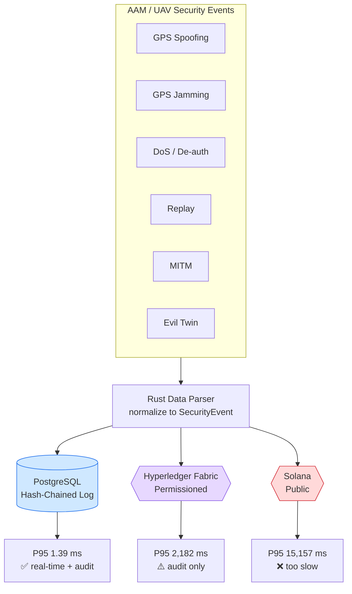
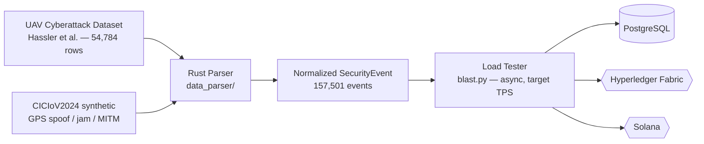
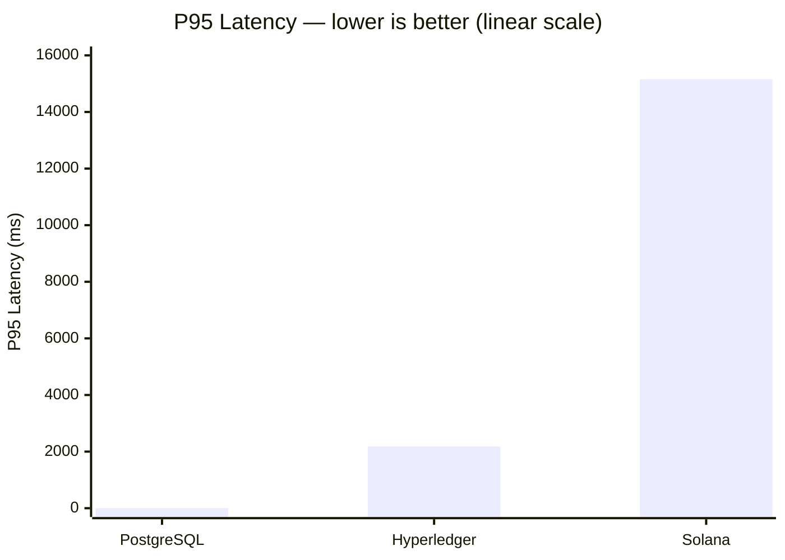
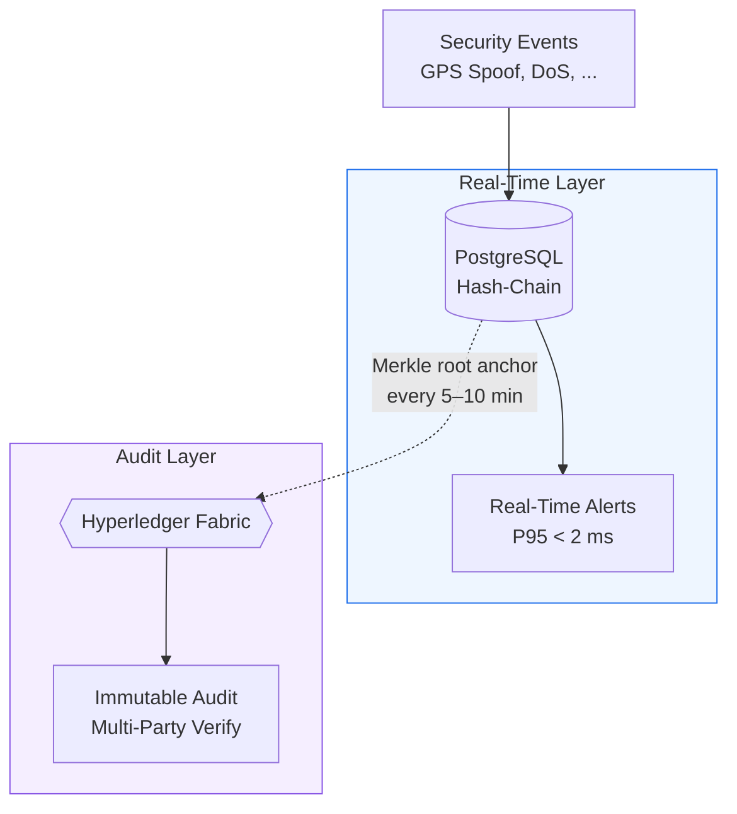
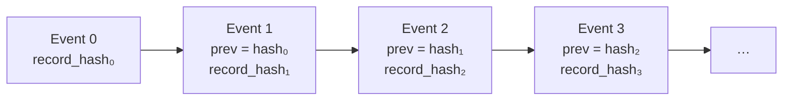
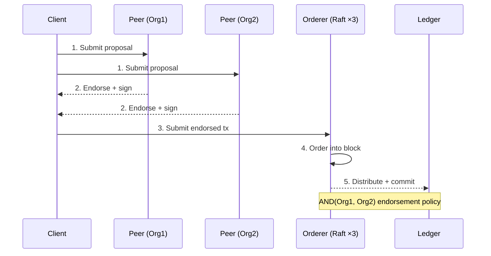

# Performance Evaluation of Blockchain-Based Security Logging for Advanced Air Mobility Systems

Empirical comparison of **PostgreSQL (hash-chained)**, **Hyperledger Fabric (permissioned blockchain)**, and **Solana (public blockchain)** for tamper-evident security-event logging in Advanced Air Mobility (AAM) systems — eVTOLs, UAVs, and urban airspace operations.

> **TL;DR** — Using a real UAV cyberattack dataset of **157,501 events** across six attack types, we measured latency, throughput, and tamper-evidence. PostgreSQL hits **1.39 ms P95** at 5,000 TPS; Hyperledger Fabric is **22× slower** (2,182 ms) and Solana **152× slower** (15,157 ms). Blockchain *cannot* meet the <100 ms real-time alerting bar, but is viable for audit trails. The recommendation is a **hybrid**: PostgreSQL for real-time + periodic blockchain anchoring for multi-party audit.

---

## What Are We Doing Here?

AAM is multi-stakeholder by nature — operators, regulators (FAA/EASA), vertiport managers, and insurers all need **tamper-evident** logs of security events (GPS spoofing, DoS, replay…), but **no single party should control the audit log**. Blockchain solves the trust problem but adds latency. This repo quantifies that trade-off end-to-end.



### Research Questions

| | Question | Answer |
|---|---|---|
| **RQ1** | Can blockchain meet AAM real-time alerts (P95 < 100 ms)? | **No** — Fabric 22×, Solana 152× over budget |
| **RQ2** | Max sustainable throughput per system? | PostgreSQL 5,000+ TPS; Fabric ~0.5–500 TPS; Solana ~2 TPS |
| **RQ3** | Does blockchain's overhead buy justified security? | Only when **multi-party trust** is required; hash-chains suffice for single operators |

---

## Data Pipeline

Raw UAV telemetry and attack captures are normalized by a Rust parser into a fixed-size `SecurityEvent`, then replayed through a load tester (`blast.py`) against each system.



**`SecurityEvent` structure** (normalized record):

```rust
struct SecurityEvent {
    timestamp_ms: i64,      // Detection time
    event_type:   u8,       // 0=Benign 1=GPSJam 2=MITM 3=Replay 4=GPSSpoof 5=DoS 6=EvilTwin
    confidence:   u8,       // Detection confidence (0-100)
    vehicle_id:   [u8; 32], // SHA-256 of vehicle ID
    data_hash:    [u8; 32], // SHA-256 of telemetry
}
```

**Attack distribution (157,501 events):** Benign 66.5% · GPS Jamming 5.6% · MITM 5.6% · Replay 5.5% · GPS Spoofing 5.5% · DoS 5.5% · Evil Twin 5.5%

---

## Systems Under Test

| System | Type | Tamper-evidence | Decentralization | Role in AAM |
|--------|------|-----------------|------------------|-------------|
| **PostgreSQL 16** | Centralized DB + hash chain | Hash chain (SHA-256) | ❌ single admin | Real-time alerting baseline |
| **Hyperledger Fabric 2.5** | Permissioned blockchain | Consensus + endorsement | ✅ known parties | Regulatory audit trail |
| **Solana (Anchor 0.30)** | Public blockchain | Consensus + Ed25519 | ✅ public | Reference public-chain bound |

---

## Key Results

### P95 Latency (ms)



> On a linear axis PostgreSQL's 1.39 ms bar is effectively invisible next to blockchain — that *is* the result: the gap spans four orders of magnitude. The 100 ms real-time threshold sits below the first gridline.

| Metric | PostgreSQL | Hyperledger | Solana |
|--------|-----------:|------------:|-------:|
| Min  | 0.53 | 2,109 | 14,580 |
| Avg  | 0.99 | 2,158 | 15,058 |
| P50  | 0.79 | 2,158 | 15,115 |
| P90  | 1.08 | 2,179 | 15,145 |
| **P95** | **1.39** | **2,182** | **15,157** |
| P99  | 5.79 | 2,274 | 15,177 |
| Max  | 44.15 | 2,274 | 15,181 |

### Requirements Assessment

| Requirement | PostgreSQL | Hyperledger | Solana |
|-------------|:----------:|:-----------:|:------:|
| Real-time (<100 ms P95) | ✅ PASS | ❌ FAIL | ❌ FAIL |
| Audit trail (<5 s P95)  | ✅ PASS | ✅ PASS | ❌ FAIL |
| Tamper evidence         | ✅ PASS | ✅ PASS | ✅ PASS |
| Decentralization        | ❌ FAIL | ✅ PASS | ✅ PASS |
| Regulatory compliance   | ⚠️ Partial | ✅ PASS | ⚠️ Partial |

No single system satisfies every requirement — which motivates the hybrid design.

---

## Recommended Hybrid Architecture

Real-time events land in PostgreSQL (sub-2 ms, 5,000+ TPS); a **Merkle root** is anchored to the blockchain every 5–10 minutes for immutable, multi-party-verifiable audit — cutting blockchain transaction volume by orders of magnitude while preserving cryptographic linkage to every event.



---

## How the Tamper-Evidence Works

### PostgreSQL hash-chained audit log

Each row's `record_hash` is `SHA-256(row data ‖ prev_hash)`. Modifying any past row invalidates every hash after it — detectable by `verify_hash_chain()`.



### Hyperledger Fabric transaction flow

Distributes trust across organizations: a transaction commits only after **both** orgs endorse and the Raft ordering service sequences it into a block.



---

## Repository Structure

```
z99_experiment/
├── run.py                  ← MAIN ENTRY POINT (PostgreSQL quick start)
├── blast.py                ← Async load tester (configurable TPS)
├── security_tests.py       ← Tamper / integrity / consensus test suite
├── docker-compose.yml      ← PostgreSQL / Solana services
├── requirements.txt        ← Python dependencies
│
├── data_parser/            ← Rust: raw CSV → normalized SecurityEvent
├── database/postgres/schema/
│   └── 001_init.sql        ← Hash-chained audit-log schema + procedures
├── blockchain/
│   ├── solana/             ← Anchor program (Rust)
│   └── hyperledger/        ← Fabric chaincode (Go)
├── src/                    ← Multi-system experiment orchestrator + clients
│   ├── run_experiment.py
│   └── clients/            ← postgres / fabric / solana clients
├── infrastructure/         ← Terraform + setup scripts (IaC)
└── final_paper_v1/         ← IEEE paper (LaTeX source)
```

---

## Quick Start

The PostgreSQL baseline runs out of the box; blockchain backends need extra setup (see Advanced sections).

```bash
# 1. Start PostgreSQL (schema auto-loads from database/postgres/schema/)
docker-compose up -d postgres

# 2. Install Python dependencies
pip install -r requirements.txt   # or: pip install psycopg2-binary

# 3. Run the experiment
python run.py                     # quick test (10 events)
python run.py --full              # latency + throughput tests
python run.py --full --tps 10 25 50 100 200   # custom TPS sweep
```

---

## Troubleshooting

**"Cannot connect to PostgreSQL"**
```bash
docker-compose up -d postgres
docker-compose ps          # check health
docker-compose logs postgres
```

**"psycopg2 not installed"** → `pip install psycopg2-binary`

**"Table does not exist"** — the schema auto-loads on first start. To reset:
```bash
docker-compose down -v && docker-compose up -d postgres
```

---

## Advanced: Solana

```bash
docker-compose up -d solana && sleep 30
curl http://localhost:8899 -X POST \
  -H "Content-Type: application/json" \
  -d '{"jsonrpc":"2.0","id":1,"method":"getHealth"}'
# → {"jsonrpc":"2.0","result":"ok","id":1}
```
Then drive it via `src/clients/solana_client/client.py`.

## Advanced: Hyperledger Fabric

Fabric needs crypto material, channel creation, and chaincode deployment:
- `infrastructure/terraform/local/main.tf` — full Terraform setup
- `blockchain/hyperledger/` — Go chaincode + network configs

---

## Citation

> D. Garcia, *Performance Evaluation of Blockchain-Based Security Logging for Advanced Air Mobility Systems*, Department of Computer Engineering, Polytechnique Montreal.

Dataset: Hassler et al., *Cyber-Physical Dataset for UAVs Under Normal Operations and Cyberattacks* (IEEE DataPort, NSF Award 2220346). Paper source in [`final_paper_v1/`](final_paper_v1/).
